<h3 align="center">Practical Exercise</h3>

## About The Project
Developing APIs with Spring Boot based on a Class Diagram.

## Tools and Technologies Used
• Java 17 • Maven • Spring Boot 3 • Spring Web • Spring Data JPA (Hibernate) • Lombok • Swagger • Validation • Tomcat • MySQL • Postman •

## Preview
- In this practical exercise, we designed three CRUD operations for Property, Owner and Rental Contract. Each operation was tested using Postman. Below are the screenshots for each CRUD operation:

### Property:

- Create Property
  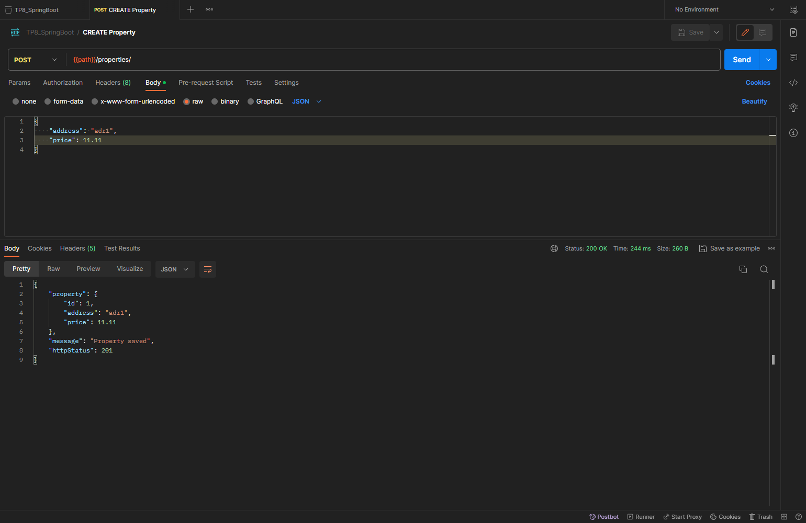

- Update Property
  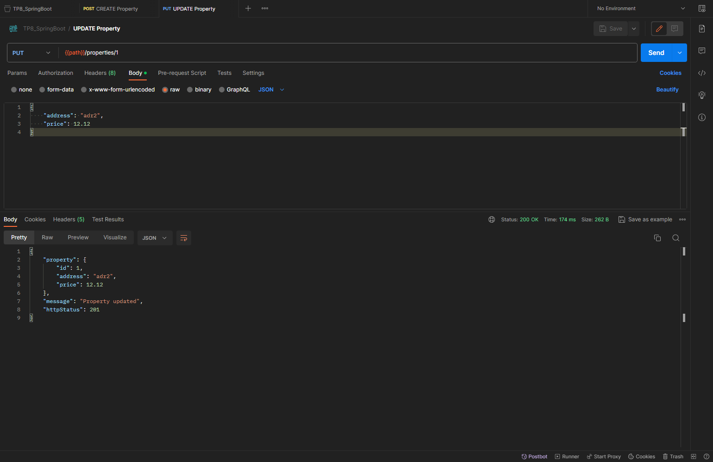

- Find Property by ID
  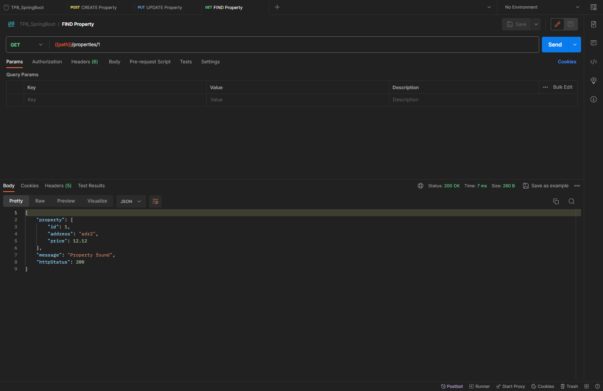

- Fetch All Properties
  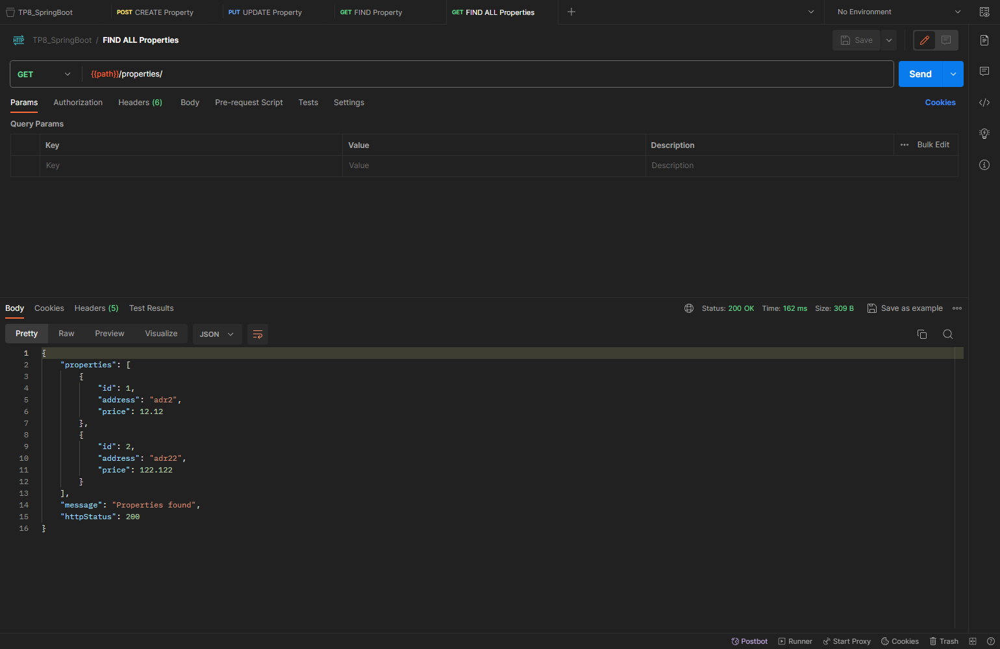

- Delete Property
  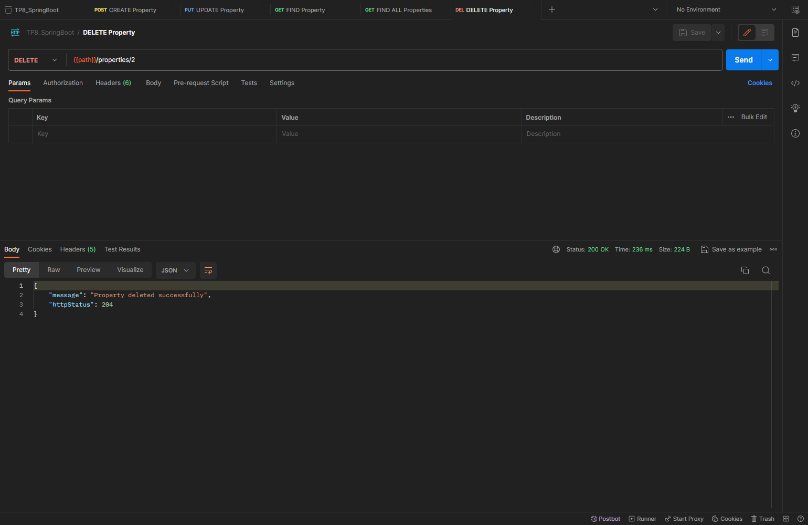

### Owner:

- Create Owner
  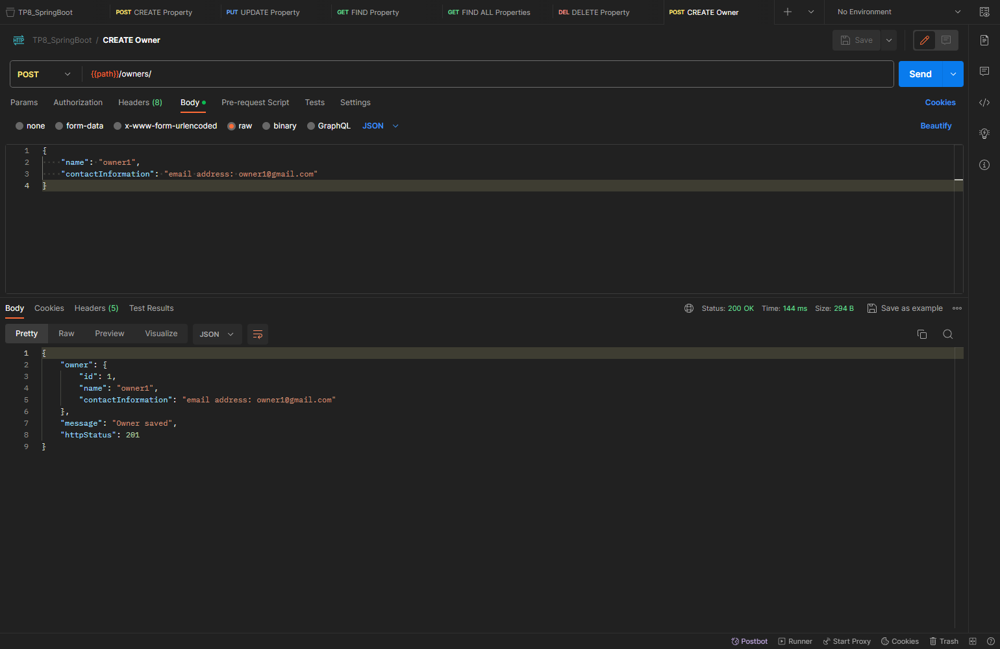

- Update Owner
  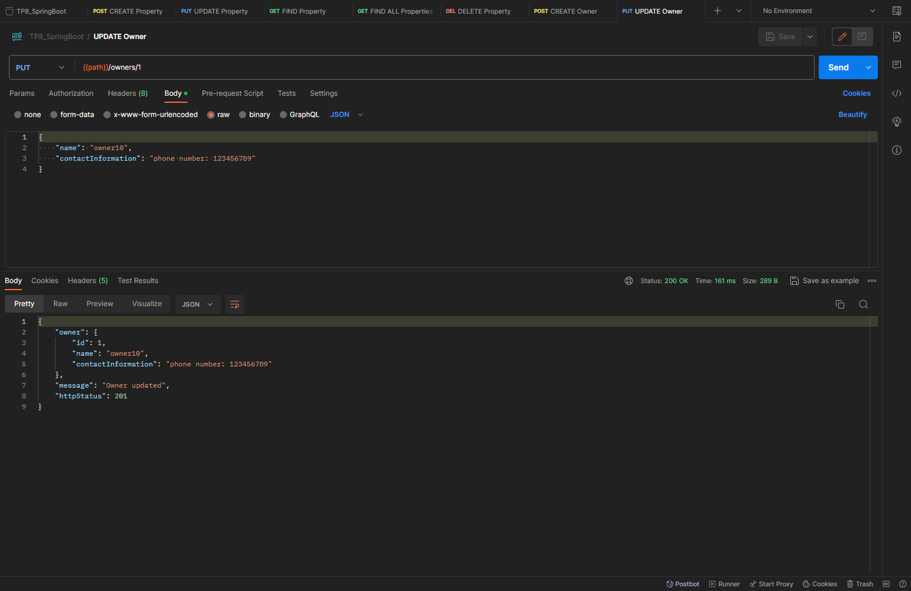

- Find Owner by ID
  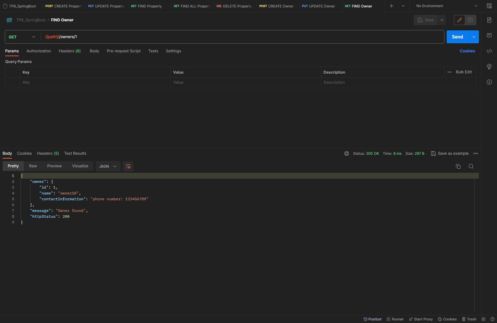

- Fetch All Owners
  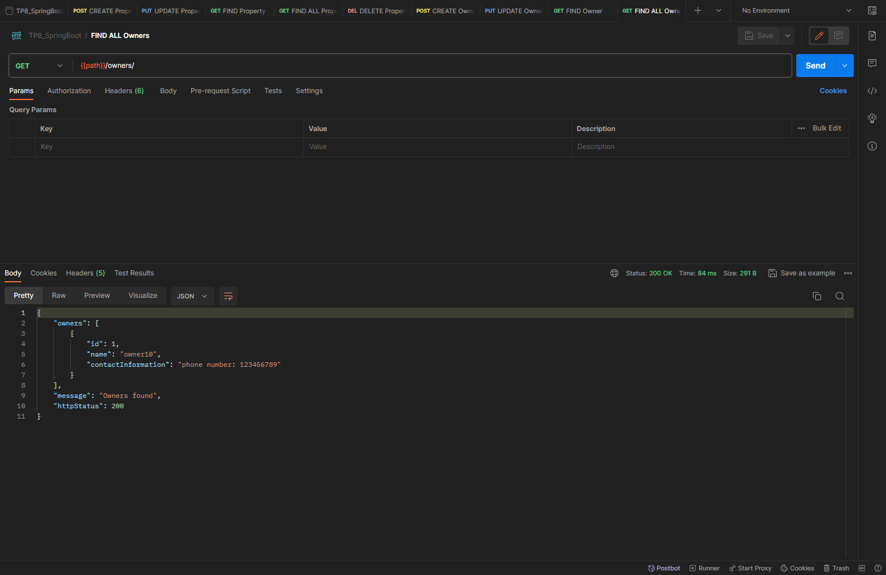

- Delete Owner
  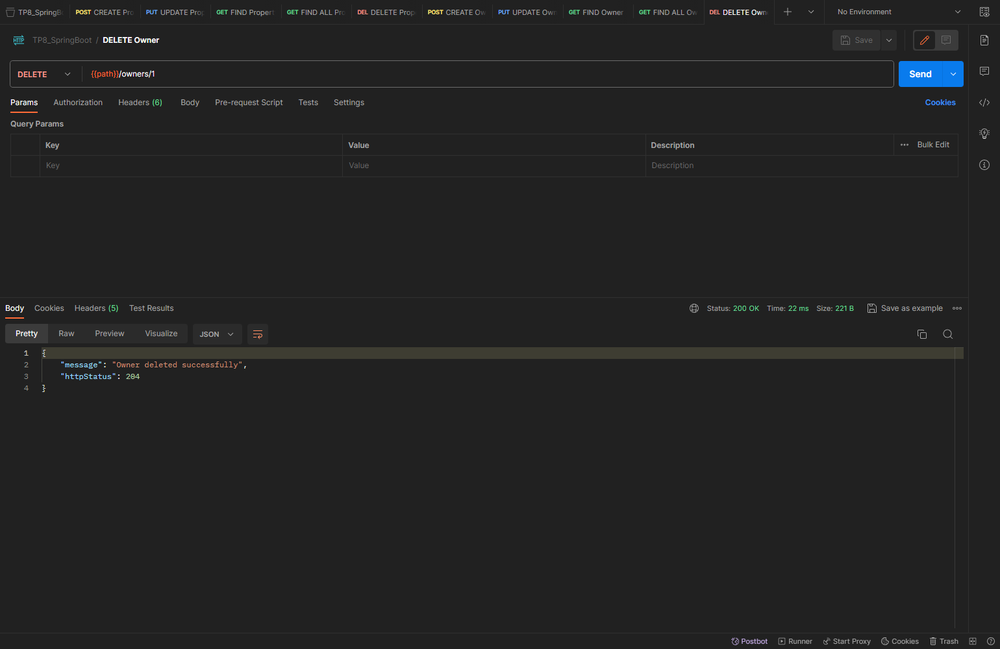

### Rental Contract:

- Create Rental Contract
  

- Update Rental Contract
  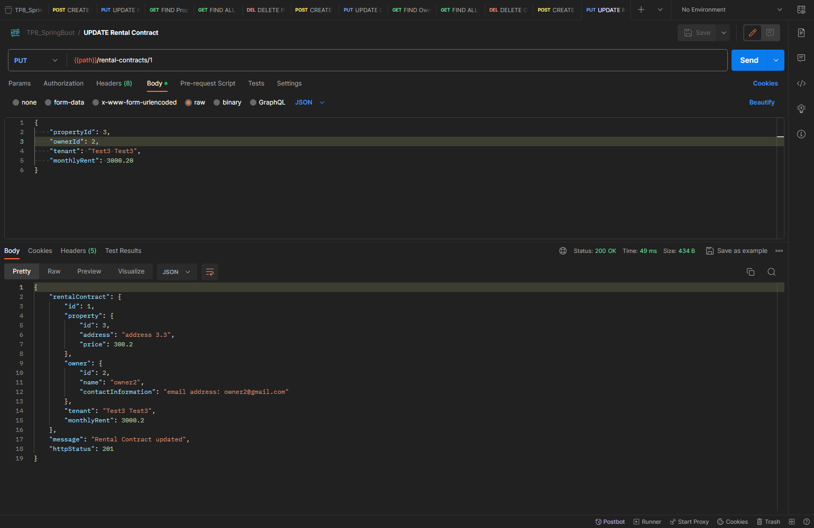

- Find Rental Contract by ID
  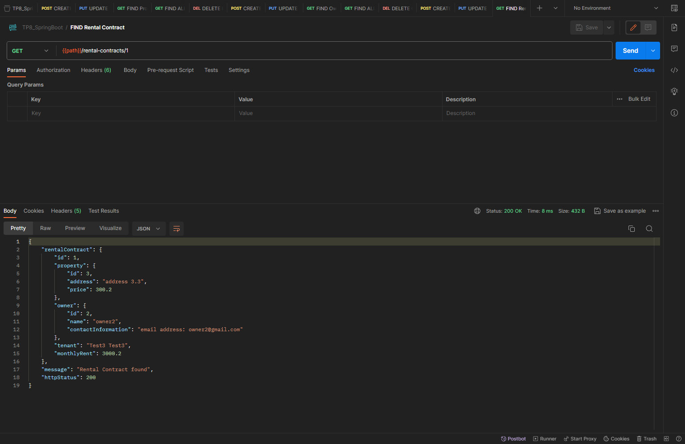

- Fetch All Rental Contracts
  

- Delete Rental Contract
  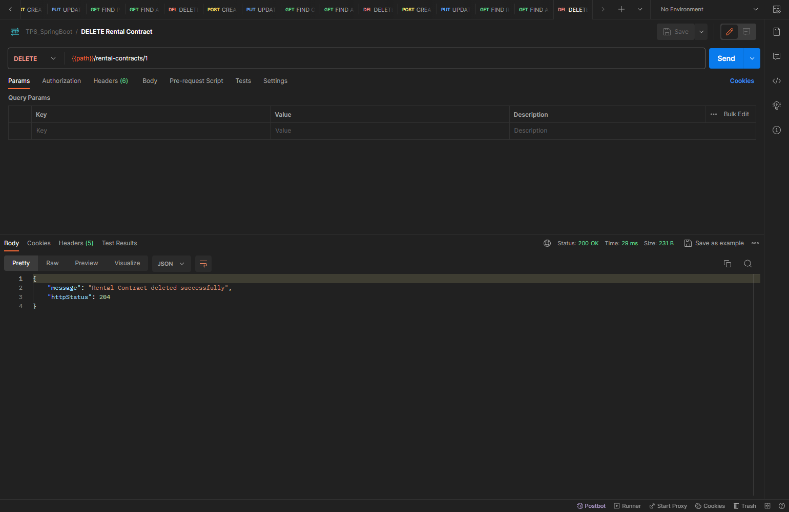

### Documentation:
- We used Swagger for API documentation to facilitate navigation, exploration, and testing of the created APIs.
 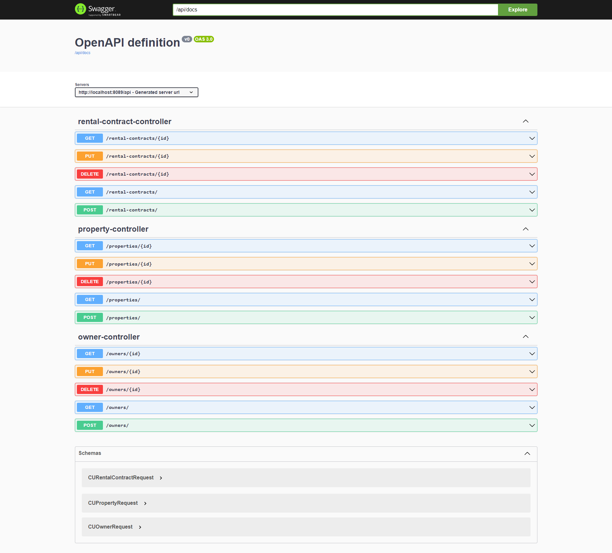

### Validation:
- Finally, we implemented validation for each request, and here is an example:
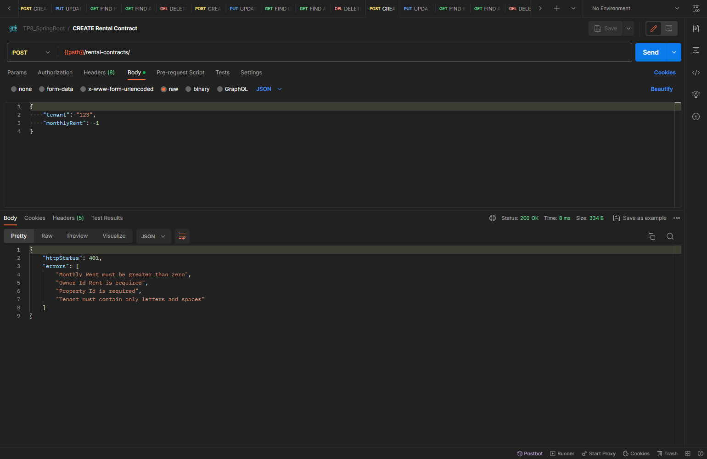

### Note:
- In the API response for fetching a Rental Contract, Rental Contracts, or during the creation of a Rental Contract, the complete attributes of the associated `Property` and `Owner` are included within the object. This behavior is typically caused by the use of eager fetching in the data model.
- To avoid this behavior, we should consider using the fetching strategy `LAZY`, additionally, utilize a DTO (Data Transfer Object) and a custom serializer to control the specific elements to be returned in the response.
